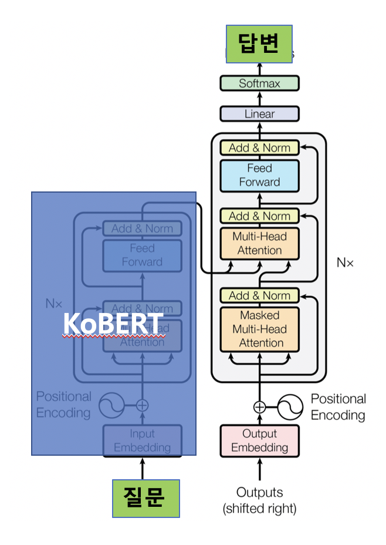
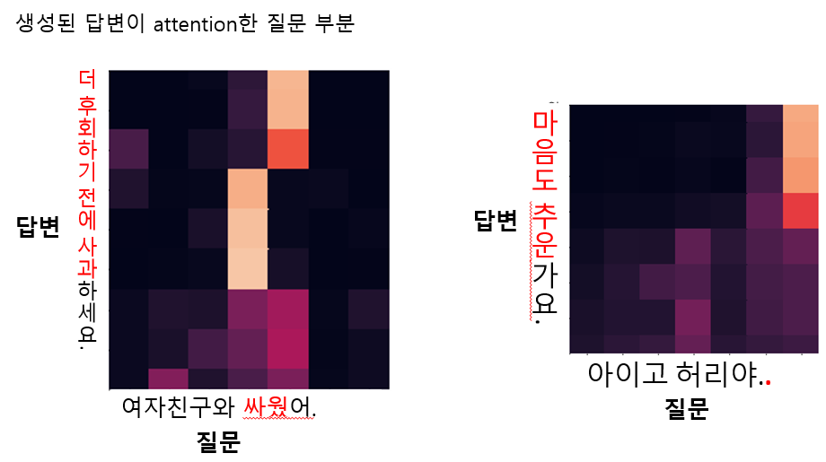

# Transformer 기반 한국어 seq2seq Chatbot

 
 

### Requirements

CUDA 10.1

### 학습 데이터

https://github.com/songys/Chatbot_data

### 학습 (fine-tuning)

`python train.py`

KoBERT (encoder)를 freeze 후, Transformer decoder를 질문/답변 데이터셋으로 fine-tuning
- KoBERT의 학습된 input embedding으로 output embedding과 softmax weights를 초기화
- output embedding는 freeze 하고, 나머지 Transformer decoder의 weight를 학습

KoBERT 사용 후, validation accuracy 10% 상승

학습 시 50% 확률로 Teacher forcing을 사용하지 않았을 때, validation accuracy 9% 상승

Decoder layer 개수를 3개에서 6개로 늘렸을 때, validation accuracy 2% 상승

### 추론 및 attention visualization

`scripts/prediction_notebook.ipynb`

 
 

### 참고

- https://github.com/SKTBrain/KoBERT
- http://nlp.seas.harvard.edu/2018/04/03/attention.html
- https://medium.com/swlh/painless-fine-tuning-of-bert-in-pytorch-b91c14912caa 
